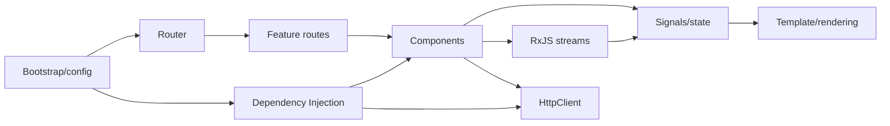

# 00 — TypeScript and the Angular Mental Model

## Wall Note / A4

- TypeScript types disappear at runtime.
- Prefer strict types, discriminated unions and explicit nullability.
- Angular is a component + DI + router + rendering + reactive-state framework.
- A component should own a clear UI responsibility and state boundary.
- Keep domain/application logic independent of framework APIs when possible.

## Detailed Notes

### TypeScript Angular developers must know

Essential:
- structural typing;
- interfaces vs type aliases;
- unions/intersections;
- discriminated unions;
- generics;
- `keyof`, indexed access and mapped types;
- utility types;
- readonly/immutability;
- optional vs nullable values;
- type narrowing;
- async/Promise types;
- decorators as framework metadata concepts;
- module/import boundaries.

Example discriminated state:

```ts
type LoadState<T> =
  | { kind: 'idle' }
  | { kind: 'loading' }
  | { kind: 'loaded'; data: T }
  | { kind: 'error'; message: string };

function renderState<T>(state: LoadState<T>) {
  switch (state.kind) {
    case 'loaded': return state.data;
    case 'error': return state.message;
    default: return null;
  }
}
```

This is safer than `data?: T; loading?: boolean; error?: string` because impossible combinations are excluded.

### Runtime reality

TypeScript cannot validate network JSON by itself. A value typed as `User` after an HTTP call is only a compile-time promise unless runtime validation exists.

### Angular mental model



Angular coordinates:
- dependency creation;
- component/view lifetime;
- template rendering;
- navigation;
- HTTP integration;
- reactive updates.

Do not force business rules into components. Components should translate user interaction into application/domain operations and render resulting state.

### Common failure modes

- `any` spreading across HTTP/state;
- duplicating server models directly in every component;
- services acting as unstructured global bags;
- components becoming page + data layer + domain layer;
- relying on type assertions (`as X`) instead of proving shape.

## Practical Example

```ts
type UserId = string & { readonly __brand: unique symbol };

interface UserSummary {
  readonly id: UserId;
  readonly displayName: string;
}

type SaveResult =
  | { ok: true; user: UserSummary }
  | { ok: false; reason: 'conflict' | 'validation' | 'network' };
```

Strong types make state transitions clearer before Angular is involved.

## Exercises / Senior Questions

1. Why can `http.get<User>()` still produce invalid runtime data?
2. Replace a boolean-heavy state model with a discriminated union.
3. When should a type assertion be considered a smell?
4. Where should business rules live relative to Angular components?
5. Explain structural typing and one risk it creates at boundaries.

## Related / Prerequisite Links

- [Programming principles](https://github.com/YosrBennagra/programming-principles)
- [Software architecture](https://github.com/YosrBennagra/software-architecture)
