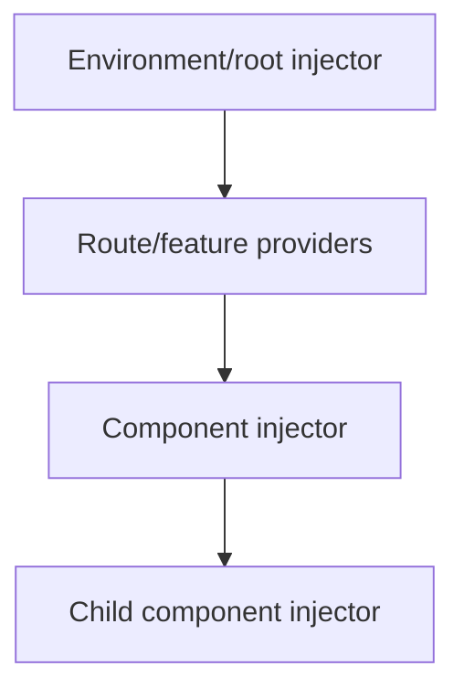

# 02 — Component Communication, Dependency Injection, Routing and Guards

## Wall Note / A4

- DI manages dependency construction/lifetime; it is not a service locator excuse.
- Provider scope determines state lifetime.
- Use InjectionToken for abstractions/config values.
- Route configuration is an architectural boundary.
- Guards control navigation UX, not server security.
- Lazy routes should align with feature boundaries.

## Detailed Notes

### Dependency injection

Angular DI resolves dependency graphs from hierarchical injectors.



A provider closer to a component can shadow a parent provider, creating a separate instance. This is powerful for feature-local state and a source of bugs when accidental.

Use tokens:

```ts
export interface Analytics {
  track(event: string): void;
}

export const ANALYTICS = new InjectionToken<Analytics>('analytics');

providers: [
  { provide: ANALYTICS, useClass: BrowserAnalytics }
]
```

Avoid injecting `Injector` everywhere and dynamically looking up arbitrary services; that hides dependencies.

### Routing

Routes model application navigation boundaries.

Good route design:
- feature-level lazy loading;
- clear URL ownership;
- typed/cohesive route data;
- minimal side effects in guards/resolvers;
- route-local providers when lifetime should follow route scope.

```ts
export const routes: Routes = [
  {
    path: 'orders',
    loadChildren: () => import('./orders/orders.routes').then(m => m.ORDER_ROUTES),
    providers: [OrdersFacade]
  }
];
```

### Guards

Use guards for navigation decisions: authenticated route, unsaved changes, entitlement-driven UX.

Never treat client guards as authorization enforcement. The backend/API must enforce permission.

### Resolvers

Resolvers can ensure route data is ready before activation, but overuse can block navigation and complicate loading/error UX. For many pages, rendering a loading state after route activation is simpler.

## Practical Example

A route-scoped facade:

```ts
@Injectable()
export class OrdersFacade {
  private api = inject(OrdersApi);
  readonly selectedOrder = signal<Order | null>(null);
}

export const ORDER_ROUTES: Routes = [{
  path: ':id',
  component: OrderPage,
  providers: [OrdersFacade]
}];
```

Each route instance can own independent state without global singleton leakage.

## Exercises / Senior Questions

1. Explain provider scope and how duplicate instances happen.
2. When should a feature use route-local providers?
3. Why is `Injector.get()` overuse harmful?
4. Guard vs resolver vs component loading: choose for three scenarios.
5. Why is a route guard not authorization?

## Related / Prerequisite Links

- [Application security](https://github.com/YosrBennagra/application-security)
- [Software architecture](https://github.com/YosrBennagra/software-architecture)
