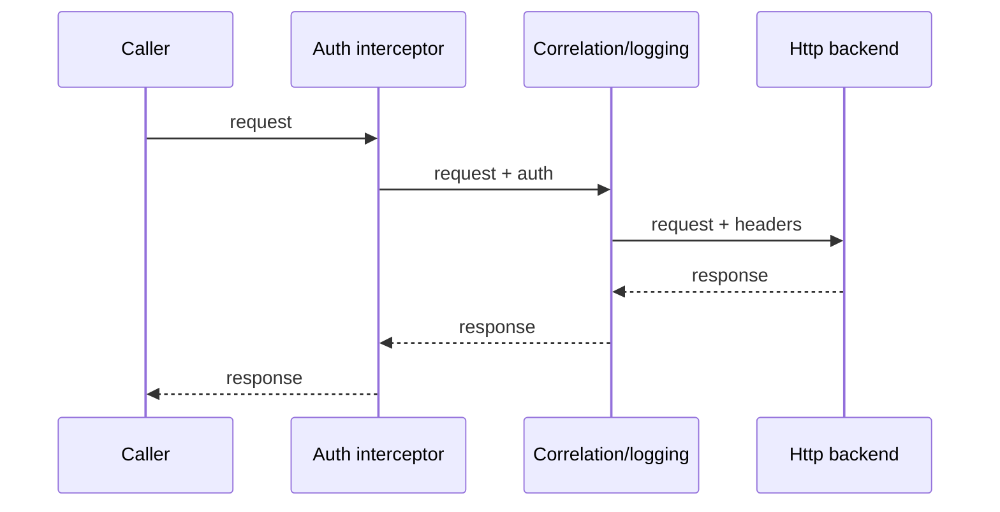

# 03 — Forms, Validation, HTTP and Interceptors

## Wall Note / A4

- Reactive forms: explicit model, scalable complex validation.
- Template forms: simple forms, less model ceremony.
- Validation belongs at multiple boundaries.
- HttpClient Observables are cold request descriptions unless shared.
- Interceptors form a chain; order and responsibility matter.
- Never hide arbitrary business logic in interceptors.

## Detailed Notes

### Forms

Choose **reactive forms** when:
- complex conditional fields;
- dynamic structure;
- cross-field validation;
- substantial testing;
- explicit state modeling matters.

Choose **template-driven forms** for simple, local forms where template declaration is clearer.

Typed reactive example:

```ts
readonly form = new FormGroup({
  email: new FormControl('', {
    nonNullable: true,
    validators: [Validators.required, Validators.email]
  }),
  age: new FormControl<number | null>(null)
});
```

### Validation

Client validation improves UX; server validation is authoritative.

Separate:
- field syntax;
- cross-field rules;
- domain/business rules;
- server-side uniqueness/authorization.

Avoid duplicating complex domain rules in Angular if the server owns truth. Represent server validation errors cleanly.

### Signal Forms (modern Angular)

Modern Angular also provides **Signal Forms** for signal-oriented form state. The current Angular API marks Signal Forms stable since v22; the guide positions them especially well for new signal-based applications while reactive forms remain a strong choice for established codebases.

Signal Forms use a writable signal as the source of truth and build a typed field tree around it:

```ts
import { form, required, email } from '@angular/forms/signals';

readonly model = signal({
  email: '',
  displayName: ''
});

readonly profileForm = form(this.model, path => {
  required(path.displayName);
  required(path.email);
  email(path.email);
});
```

Choose based on the application's architecture and migration cost, not novelty. Do not mix three forms paradigms inside one feature without a deliberate interoperability reason.

For deeper mechanics, validation schemas, submission and migration guidance, see [Signal Forms deep dive](16-signal-forms-deep-dive.md).

### HTTP

```ts
getOrder(id: string): Observable<OrderDto> {
  return this.http.get<OrderDto>(`/api/orders/${encodeURIComponent(id)}`);
}
```

Remember: TypeScript generics do not runtime-validate JSON. Consider boundary validation where malformed/third-party data is plausible.

### Interceptor chain



Good interceptor concerns:
- auth header/token attachment;
- correlation/request IDs;
- normalized transport-level errors;
- caching only when semantics are explicit;
- retry only for safe/retryable operations.

Bad:
- feature business rules;
- silent infinite retries;
- globally swallowing errors;
- mutation of unrelated payloads.

## Practical Example

Functional interceptor:

```ts
export const authInterceptor: HttpInterceptorFn = (req, next) => {
  const session = inject(SessionService);
  const token = session.token();

  return next(token
    ? req.clone({ setHeaders: { Authorization: `Bearer ${token}` } })
    : req
  );
};
```

## Exercises / Senior Questions

1. Reactive vs template forms for a dynamic onboarding flow?
2. Where should uniqueness validation be authoritative?
3. Why can retrying POST be dangerous?
4. How does interceptor ordering affect behavior?
5. What validation is still needed after `http.get<User>()`?

## Related / Prerequisite Links

- [API engineering](https://github.com/YosrBennagra/api-engineering)
- [Application security](https://github.com/YosrBennagra/application-security)
