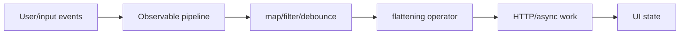

# 04 — RxJS and Reactive Programming

## Wall Note / A4

- Observable = lazy stream over time.
- Operator choice expresses concurrency semantics.
- `switchMap`: cancel stale inner work.
- `concatMap`: preserve order.
- `mergeMap`: concurrent inner work.
- `exhaustMap`: ignore new triggers while busy.
- Unsubscribe by lifecycle/ownership, not superstition.
- Share/caching semantics must be explicit.

## Detailed Notes

### Mental model



RxJS is strongest for event/time/asynchrony: HTTP, route changes, websockets, user events, retries, cancellation and composition.

### Flattening operators

**switchMap** — latest wins; ideal for search/typeahead.

**concatMap** — serialize inner work; ideal when order matters.

**mergeMap** — parallel inner work; bound concurrency if necessary.

**exhaustMap** — ignore repeated triggers while one is active; useful for submit/login anti-double-click flows.

The operator is a business/concurrency decision, not style.

### Hot vs cold

HttpClient calls are generally cold: each subscription can create a request. Multicasting/sharing can prevent duplicate work, but cache invalidation/lifetime must be explicit.

### Error handling

Place `catchError` where you intend recovery. Catching outside a long-lived stream can terminate it unexpectedly; catching inside the inner stream can allow future outer events.

### Subscription ownership

Prefer:
- async/template bindings;
- signals interop where appropriate;
- lifecycle-aware teardown;
- higher-order operators.

Manual subscriptions are legitimate for imperative side effects but must have clear lifetime.

### Backpressure

Browser Observables do not magically solve producer/consumer mismatch. Use debounce, throttle, buffering, sampling or explicit queue semantics based on behavior.

## Practical Example

Search:

```ts
results$ = this.query.valueChanges.pipe(
  debounceTime(250),
  distinctUntilChanged(),
  switchMap(query =>
    this.api.search(query).pipe(
      catchError(() => of([]))
    )
  )
);
```

`switchMap` is correct because stale searches should be canceled/ignored.

## Exercises / Senior Questions

1. Pick flattening operators for search, file upload queue, parallel enrichment and login submit.
2. Why can multiple subscriptions duplicate HTTP calls?
3. Where should `catchError` live in a long-lived search stream?
4. How do you test debounce without real time?
5. When should a signal replace an Observable—and when not?

## Related / Prerequisite Links

- [Testing engineering](https://github.com/YosrBennagra/testing-engineering)
- Next: [Signals and state](05-signals-state.md)
