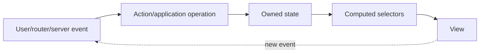

# 05 — Signals, Computed State, Effects and State Management

## Wall Note / A4

- Signal = synchronous reactive value.
- Computed = derived state; keep it pure.
- Effect = side effect; do not use it to derive state.
- State should have one clear owner.
- Local component/feature state first.
- Introduce NgRx when complexity/coordination/debugging needs justify it.

## Detailed Notes

### Signals

```ts
readonly quantity = signal(1);
readonly unitPrice = signal(25);
readonly total = computed(() => this.quantity() * this.unitPrice());
```

A computed value is cached and tracks dependencies. Do not manually synchronize `total` through effects.

### Effects

Good uses:
- bridge reactive state to imperative API;
- logging/analytics;
- persistence to storage when explicitly designed;
- third-party widget synchronization.

Bad:
```ts
effect(() => this.total.set(this.qty() * this.price()));
```

That is derived state; use `computed`.

### State flow



Avoid circular write chains between effects.

### Signals + RxJS

Use signals for synchronous state consumed by templates/components. Use RxJS for async/event streams and cancellation/concurrency. Interop at deliberate boundaries.

### When NgRx is justified

NgRx becomes valuable when several are true:
- large shared state;
- many features coordinate on it;
- complex event-driven transitions;
- strong need for traceability/devtools;
- normalized entity collections;
- effects/orchestration are substantial;
- team benefits from rigid conventions.

Do **not** introduce it because "senior apps use NgRx." A small feature store/facade with signals may be better.

## Practical Example

```ts
@Injectable()
export class CartStore {
  private readonly _items = signal<CartItem[]>([]);
  readonly items = this._items.asReadonly();
  readonly count = computed(() =>
    this._items().reduce((n, i) => n + i.quantity, 0)
  );

  add(item: CartItem) {
    this._items.update(items => upsert(items, item));
  }
}
```

State ownership is explicit and mutations are centralized.

## Exercises / Senior Questions

1. Computed vs effect: explain with three examples.
2. What problems come from effect-driven state synchronization?
3. When should shared state be route-scoped vs root-scoped?
4. Design criteria for choosing NgRx.
5. How would you combine websocket RxJS events with signal state?

## Related / Prerequisite Links

- [Programming principles](https://github.com/YosrBennagra/programming-principles)
- [Software architecture](https://github.com/YosrBennagra/software-architecture)
