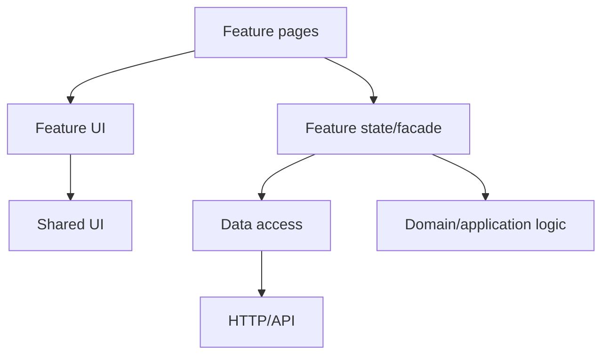

# 06 — Feature-Based Architecture, Reusable Components and Libraries

## Wall Note / A4

- Organize around business capabilities, not file types.
- Feature owns its routes, UI, state and adapters.
- Shared should mean genuinely reusable and domain-neutral.
- A facade can protect components from orchestration complexity.
- Libraries need stable public APIs and dependency discipline.
- Avoid "shared" dumping grounds.

## Detailed Notes

### Feature-first structure

```text
src/app/
  core/                 # true application-wide infrastructure
  shared/               # generic UI/utilities only
  features/
    orders/
      pages/
      ui/
      data-access/
      state/
      orders.routes.ts
    customers/
      ...
```

Names are flexible; dependency direction is what matters.



### Core vs shared

**core**: singleton-level app concerns such as session bootstrap or global error infrastructure.

**shared**: reusable presentational components, pipes, directives and utilities without feature-specific knowledge.

If a shared component imports OrdersService, it is not truly shared.

### Facades

A facade can provide:
- stable UI-facing API;
- state selectors/signals;
- orchestration;
- abstraction over NgRx or HTTP.

Do not build a facade that merely renames every service method one-for-one.

### Libraries

A good internal/public Angular library:
- exposes a deliberate public API;
- avoids deep imports;
- minimizes peer/runtime dependencies;
- does not depend on application-specific global state;
- documents provider setup;
- separates presentational UI from data access.

### Smart vs presentational

This is a spectrum, not a law. The valuable question is ownership:
- who fetches/coordinates?
- who owns state?
- who renders and emits intent?

## Practical Example

Order feature boundary:

```text
orders/
  orders.routes.ts
  pages/order-list.page.ts
  ui/order-table.component.ts
  data-access/orders.api.ts
  state/orders.store.ts
  models/order-view.model.ts
```

Only `orders.routes.ts` needs to be imported by the parent routing layer.

## Exercises / Senior Questions

1. Refactor a file-type structure into feature boundaries.
2. What belongs in shared vs core?
3. When is a facade useful vs redundant?
4. How do you prevent cross-feature deep imports?
5. What makes an Angular library hard to reuse?

## Related / Prerequisite Links

- [Software architecture](https://github.com/YosrBennagra/software-architecture)
- [Programming principles](https://github.com/YosrBennagra/programming-principles)
