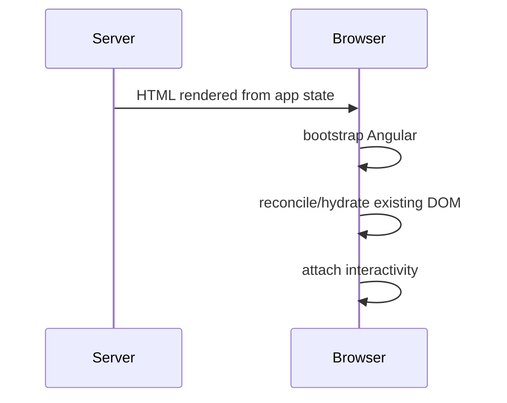

# 09 — Testing, SSR/Hydration, Configuration, Debugging and Profiling

## Wall Note / A4

- Test user-visible Angular behavior, not private fields.
- Use real Angular wiring where framework integration is the risk.
- SSR runs code outside the browser; guard browser-only APIs.
- Hydration requires server/client output compatibility.
- Build-time config is not the same as runtime config.
- Debug from state → stream → network → rendering, not by guessing.

## Detailed Notes

### Angular testing

Deep testing strategy belongs in [testing-engineering](https://github.com/YosrBennagra/testing-engineering). Angular-specific concerns include:

- component TestBed/setup;
- provider overrides;
- Http testing backend;
- router testing/navigation;
- signal state updates;
- DOM/accessibility assertions;
- lifecycle and DI integration.

Prefer behavior:
```ts
await user.click(screen.getByRole('button', { name: /save/i }));
expect(screen.getByRole('status')).toHaveTextContent(/saved/i);
```

Avoid asserting private fields or internal method-call choreography.

### SSR

Server rendering improves initial HTML delivery and can help discoverability/perceived startup, but adds constraints:
- no unconditional `window`/`document` access;
- request-specific state must not leak across requests;
- data fetching should avoid duplicate server+client work;
- cookies/headers differ by environment.

### Hydration



Server and client must produce compatible structure/state. Random values, current time and browser-only branches can create mismatch.

### Configuration

Separate:
- compile/build-time constants;
- deployment/runtime environment values;
- secrets (never shipped as frontend secrets).

A value embedded into JS is visible to users. Frontend "environment variables" are configuration, not secure secrets.

### Debugging

Systematic path:
1. reproduce/minimize;
2. inspect component state/signals;
3. inspect RxJS emissions/subscriptions;
4. inspect router params/resolution;
5. inspect network requests/responses;
6. inspect change detection/rendering;
7. profile only after correctness path is understood.

### Profiling

Look for:
- repeated requests;
- repeated computations;
- retained subscriptions/listeners;
- giant DOM;
- large route bundles;
- long tasks;
- expensive third-party scripts.

## Practical Example

SSR-safe browser access:

```ts
const platformId = inject(PLATFORM_ID);

if (isPlatformBrowser(platformId)) {
  localStorage.setItem('theme', 'dark');
}
```

Better still, isolate browser storage behind an adapter if used broadly.

## Exercises / Senior Questions

1. Which Angular tests require real DI/router wiring?
2. Why can current time cause hydration mismatch?
3. Distinguish build-time and runtime config.
4. Why can a frontend env var never be a true secret?
5. Diagnose duplicate HTTP calls after adding SSR.

## Related / Prerequisite Links

- [Testing engineering](https://github.com/YosrBennagra/testing-engineering)
- [DevOps/platform engineering](https://github.com/YosrBennagra/devops-platform-engineering)
