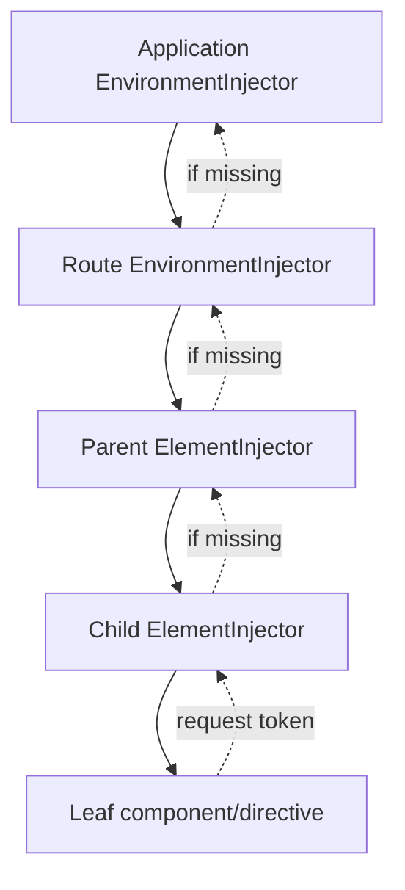

# 11 — DI, Provider Scopes and Routing Lifetimes: Deep Dive

## Wall Note / A4

- Provider location defines **instance lifetime + visibility**.
- Angular resolves through element injectors and environment injectors.
- Root state is global state unless proven otherwise.
- Route providers are excellent for feature/session-like lifetimes.
- Component providers create subtree-local instances.
- InjectionToken expresses an abstraction/configuration boundary.
- Avoid dynamic injector lookup when ordinary dependency declaration works.
- Router boundaries are application architecture, not just URLs.

## Detailed Notes

### 1. Two important injector hierarchies

Modern Angular applications primarily involve:

- **EnvironmentInjector hierarchy** — application/bootstrap, route and other environment-level providers.
- **ElementInjector hierarchy** — providers attached to components/directives in the rendered tree.

Resolution is hierarchical. The closest matching provider wins.



This is why adding the same service to a component's `providers` can accidentally create a new instance and "lose" state that another part of the app sees.

### 2. Lifetime is an architecture decision

Typical lifetimes:

**Application-wide**
- session identity;
- telemetry adapter;
- global configuration;
- long-lived caches that truly span features.

**Route/feature**
- wizard state;
- selected entity for a feature;
- feature-specific facade/store;
- feature-scoped cache.

**Component/subtree**
- isolated editor state;
- compound component controller;
- per-widget service.

The shortest useful lifetime is usually safer because it reduces hidden coupling and stale state.

### 3. Root singleton smell

A root service is not wrong. It becomes a smell when:
- mutable feature state accumulates;
- unrelated pages can mutate the same state;
- tests depend on resetting singleton state;
- navigation does not naturally clear state;
- the service becomes a "god store."

Ask: *would two simultaneous instances of this feature need independent state?* If yes, root scope is probably wrong.

### 4. InjectionToken for contracts

Use tokens for:
- interfaces;
- environment-specific adapters;
- configuration values;
- platform-dependent implementations.

```ts
export interface AuditSink {
  record(event: AuditEvent): void;
}

export const AUDIT_SINK =
  new InjectionToken<AuditSink>('AUDIT_SINK');

export const auditProviders = [
  { provide: AUDIT_SINK, useClass: BrowserAuditSink }
];
```

This keeps consumers dependent on a capability, not a concrete class.

### 5. Factory providers

Factories are useful when construction depends on other injected values:

```ts
export const API_BASE_URL =
  new InjectionToken<string>('API_BASE_URL');

export const apiClientProvider = {
  provide: ApiClient,
  useFactory: () => new ApiClient(inject(API_BASE_URL)),
};
```

Do not use factories to hide arbitrary runtime service lookup or business branching.

### 6. Resolution modifiers

Senior engineers should understand the intent of:
- `optional`;
- `self`;
- `skipSelf`;
- `host`.

They are useful in reusable directives/compound components where the lookup boundary is meaningful. Overuse often indicates unclear ownership.

### 7. Route-level providers

A route can establish a feature lifetime:

```ts
export const ORDERS_ROUTES: Routes = [
  {
    path: '',
    providers: [OrdersStore, OrdersFacade],
    children: [
      { path: '', component: OrdersListPage },
      { path: ':id', component: OrderDetailsPage }
    ]
  }
];
```

When the route environment is destroyed, its feature-scoped dependencies can be collected too.

Use this for state that should survive navigation **inside** a feature but disappear when leaving it.

### 8. Router architecture

A senior route tree should communicate:
- feature ownership;
- lazy-loading boundaries;
- access/navigation policy;
- route-local providers;
- data requirements;
- error/not-found handling.

Avoid a giant root route file that imports every feature directly.

### 9. Guards vs authorization

A guard answers a client-navigation question:
- should the UI activate this route?
- should the user be redirected?

It does **not** secure data or actions. The API/backend must enforce authorization independently.

### 10. Resolver trade-offs

Resolver advantages:
- data ready before page activation;
- useful for data that is structurally required.

Costs:
- navigation blocks;
- error/loading UX can become indirect;
- route transition can feel frozen;
- resolver chains can grow into hidden orchestration.

Many pages are clearer when activated immediately and show explicit loading/error state.

### 11. Route parameters as state

Use URL state for values that should be:
- bookmarkable;
- shareable;
- browser-history-aware;
- restorable after refresh.

Examples:
- selected record ID;
- page/filter state when meaningful;
- tabs tied to navigation.

Do not store everything in global state if the URL already owns it.

## Practical Example — feature-scoped state

```ts
@Injectable()
export class CustomerEditStore {
  private api = inject(CustomersApi);

  readonly customerId = signal<string | null>(null);
  readonly model = signal<CustomerEditModel | null>(null);
  readonly saving = signal(false);

  async save() {
    const model = this.model();
    if (!model || this.saving()) return;

    this.saving.set(true);
    try {
      await firstValueFrom(this.api.save(model));
    } finally {
      this.saving.set(false);
    }
  }
}

export const CUSTOMER_ROUTES: Routes = [
  {
    path: ':id/edit',
    component: CustomerEditPage,
    providers: [CustomerEditStore]
  }
];
```

This prevents stale edit state from living forever in a root singleton.

## Failure Modes

- Service unexpectedly instantiated twice because it is provided in both root and component.
- Route leaves but global feature state remains.
- Reusable component depends on a root application service.
- Guard contains business authorization rules duplicated from backend.
- Resolver performs writes/side effects.
- A service injects `Injector` and fetches dependencies dynamically, hiding its real graph.
- Root provider creates hidden coupling between tests.

## Senior Review Checklist

For each provider:
1. Who owns the instance?
2. When should it be created?
3. When should it die?
4. Who is allowed to see it?
5. Is state mutable?
6. Would two feature instances need separate copies?
7. Could a plain function/value be better than an injectable?

For each route:
1. Is the boundary feature-oriented?
2. Should it lazy-load?
3. Does URL state reflect navigation state?
4. Is a guard only UX/navigation?
5. Is blocking resolution intentional?

## Exercises / Senior Questions

1. Diagnose a service whose state disappears in one child but not another.
2. Refactor a root-scoped wizard store into an appropriate lifetime.
3. Design route providers for two simultaneous editor shells.
4. Explain `self`, `skipSelf` and `host` using a reusable form-control example.
5. When should route state be in the URL instead of a store?
6. Review a resolver that calls three APIs and performs a mutation.

## Related / Prerequisite Links

- [DI/routing core](02-communication-di-routing.md)
- [Feature architecture](06-architecture-libraries.md)
- [Software architecture](https://github.com/YosrBennagra/software-architecture)
- [Application security](https://github.com/YosrBennagra/application-security)
