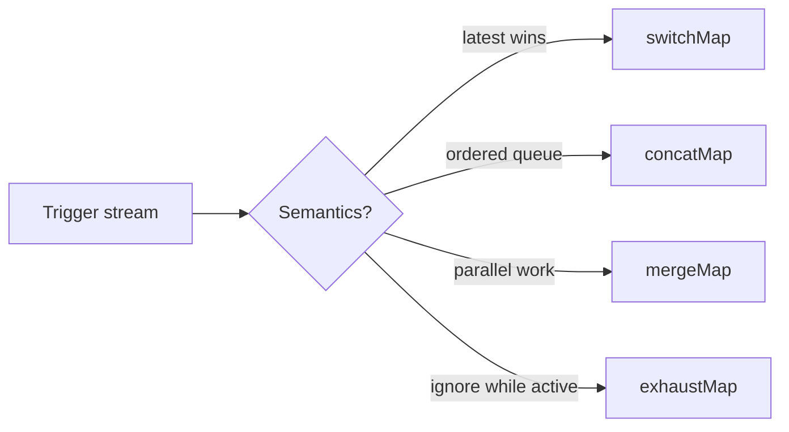

# 12 — RxJS, Signals and State Concurrency: Deep Dive

## Wall Note / A4

- RxJS models **events over time**.
- Signals model **synchronous reactive state**.
- Operator choice is concurrency policy.
- `computed` derives; `effect` performs side effects.
- Do not mirror the same state independently in Observable + signal + store.
- Cancellation semantics matter for writes.
- `linkedSignal` is useful for writable state dependent on another signal.
- Async signal resources need explicit loading/error/identity thinking.

## Detailed Notes

### 1. State vs event stream

Signals are natural when a consumer wants **the current value now**.

Observables are natural when behavior depends on:
- event order;
- time;
- cancellation;
- multiple emissions;
- retries;
- websockets;
- user input streams.

Do not choose based on fashion. Choose based on semantics.

### 2. The flattening operators are concurrency controls



#### switchMap

Correct when old work becomes irrelevant:
- search queries;
- selected-record loading;
- route-driven reads.

Dangerous for writes if cancellation can abandon a request whose side effect still completes remotely.

#### concatMap

Correct when order must be preserved:
- sequential saves;
- command queue;
- ordered upload chunks.

Cost: slow task blocks later tasks.

#### mergeMap

Correct for independent concurrent work.

Control concurrency if source can produce unbounded work.

#### exhaustMap

Correct when first trigger owns the operation until completion:
- login submit;
- checkout submit;
- "generate report" button.

### 3. Cancellation is not rollback

Unsubscribing from an HTTP Observable prevents the Angular consumer from caring about the result and may abort the browser request, but it cannot guarantee a remote side effect never happened.

For write APIs, server-side idempotency and operation semantics matter.

### 4. Signals: source vs derivation

```ts
readonly items = signal<CartItem[]>([]);
readonly subtotal = computed(() =>
  this.items().reduce((sum, x) => sum + x.price * x.qty, 0)
);
```

Never store `subtotal` separately unless it has independent domain meaning.

### 5. Effects

Good:
- update imperative chart library;
- persist preference to local storage;
- analytics;
- bridge to a non-reactive API.

Bad:
- copy one signal into another;
- maintain derived state;
- coordinate business workflows via chains of effects.

Effect chains are difficult because causality becomes implicit.

### 6. linkedSignal

Use writable dependent state when:
- a current selection depends on a changing set of options;
- the derived default should update when source state changes;
- users may override the default locally.

Example:

```ts
readonly shippingOptions = signal<ShippingOption[]>([]);

readonly selectedShipping = linkedSignal({
  source: this.shippingOptions,
  computation: (options, previous) => {
    const prior = previous?.value;
    return options.some(x => x.id === prior?.id)
      ? prior!
      : options[0] ?? null;
  }
});
```

Use `computed` instead when the value should not be independently writable.

### 7. Async signal resources

Modern Angular provides resource-style APIs for integrating asynchronous loaders into signal-oriented state.

Model:
- request parameters;
- current status;
- resolved value;
- error;
- identity/caching behavior.

Do not convert every RxJS flow to a resource. Streams with many emissions, user events, websocket feeds and sophisticated cancellation/composition remain naturally RxJS-shaped.

### 8. Interop boundary

One robust pattern:

```text
Router/user events (Observable)
        ↓
Concurrency/orchestration (RxJS)
        ↓
Feature state mutation (signal/store)
        ↓
Computed selectors
        ↓
Template
```

Do not bounce repeatedly Observable → signal → Observable without a reason.

### 9. State ownership

State levels:
- component-local;
- route/feature;
- application-wide;
- server-owned/cache.

Start at the narrowest scope.

A feature store can expose readonly signals and command methods:

```ts
@Injectable()
export class OrdersStore {
  private readonly _orders = signal<Order[]>([]);
  readonly orders = this._orders.asReadonly();
  readonly openOrders = computed(() =>
    this._orders().filter(x => x.status === 'OPEN')
  );

  replace(orders: Order[]) {
    this._orders.set(orders);
  }
}
```

### 10. When NgRx is justified

Use a structured state library when complexity is real:
- many coordinated features;
- large event graph;
- normalized shared entities;
- complex side-effect orchestration;
- debugging/traceability needs;
- consistent team architecture at scale.

Avoid it for a small isolated CRUD screen.

### 11. Error state

Do not collapse all failure into `null`.

Prefer explicit state:

```ts
type RemoteState<T> =
  | { kind: 'idle' }
  | { kind: 'loading' }
  | { kind: 'ready'; value: T }
  | { kind: 'error'; error: AppError };
```

This prevents ambiguous UI.

## Practical Example — route-driven load

```ts
readonly order$ = this.route.paramMap.pipe(
  map(params => params.get('id')),
  filter((id): id is string => !!id),
  distinctUntilChanged(),
  switchMap(id =>
    this.api.getOrder(id).pipe(
      map(order => ({ kind: 'ready', order } as const)),
      startWith({ kind: 'loading' } as const),
      catchError(error =>
        of({ kind: 'error', error: toAppError(error) } as const)
      )
    )
  )
);
```

Here, latest-route selection wins. This is correct because old reads are obsolete.

## Practical Example — submit without double execution

```ts
private readonly saveClicks = new Subject<void>();

readonly saveResult$ = this.saveClicks.pipe(
  exhaustMap(() =>
    this.api.save(this.form.getRawValue()).pipe(
      materialize()
    )
  )
);

save() {
  this.saveClicks.next();
}
```

`exhaustMap` means repeated clicks do not start overlapping saves while the first is active.

## Failure Modes

- `switchMap` on non-idempotent writes without thinking about remote outcome.
- Nested subscriptions.
- Signals duplicated into BehaviorSubjects with two sources of truth.
- `effect` used as a derived-state engine.
- Global store introduced for purely local state.
- Observable subscription created imperatively and never owned/cleaned.
- `shareReplay` used as an accidental permanent cache with unclear invalidation.

## Exercises / Senior Questions

1. Choose flattening operators for autosave, login, search, bulk enrichment and upload queue.
2. Explain why unsubscribe is not equivalent to remote transaction rollback.
3. Replace an effect-driven derived signal with `computed`.
4. Design a feature using RxJS for orchestration and signals for current state.
5. When is `linkedSignal` better than `computed`?
6. Review a `shareReplay(1)` cache: define lifetime and invalidation.

## Related / Prerequisite Links

- [RxJS core](04-rxjs.md)
- [Signals/state core](05-signals-state.md)
- [Testing engineering](https://github.com/YosrBennagra/testing-engineering)
