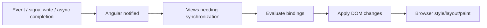

# 13 — Rendering, Zoneless Change Detection and Performance: Deep Dive

## Wall Note / A4

- Performance = network + JavaScript + rendering + memory + backend latency.
- Modern Angular can operate zoneless; state changes must notify Angular explicitly through supported reactive/event mechanisms.
- Signals provide precise reactive dependencies.
- Stable list identity prevents unnecessary DOM churn.
- `@defer` splits code for non-critical template regions.
- Lazy loading has loading-state and network costs.
- Measure before optimizing.

## Detailed Notes

### 1. Rendering mental model

At a high level:



Performance can be lost at any stage.

Do not call every slow page a "change detection problem."

### 2. Zoneless Angular

Current Angular supports zoneless operation, and modern releases increasingly rely on explicit framework notifications instead of ZoneJS patching every async browser task.

Important notification sources include:
- signal writes read by templates;
- Angular-handled events;
- input changes;
- view attachment/removal;
- explicit APIs that schedule synchronization.

Senior implication: code should express state changes through Angular-aware reactive mechanisms rather than rely on broad async patching.

**Version-sensitive note:** verify exact defaults and migration APIs against your project Angular version.

### 3. Why zoneless matters architecturally

With zone-based broad detection, an unrelated async task can trigger view synchronization.

Zoneless architecture encourages:
- explicit reactive state;
- clearer ownership;
- fewer accidental render passes;
- easier reasoning about why a view updates.

But correctness matters more than micro-optimization. Do not force manual rendering controls everywhere.

### 4. Signals and view dependencies

When a template reads a signal, the framework can associate the view with that reactive dependency.

This favors:
- small state ownership boundaries;
- computed derived values;
- immutable updates;
- fewer getter-based recomputations.

### 5. Stable identity

```html
@for (customer of customers(); track customer.id) {
  <app-customer-row [customer]="customer" />
}
```

Tracking by stable identity lets Angular preserve DOM/component instances when collection ordering/content changes.

Tracking by index is incorrect when rows can be inserted, removed or reordered and row identity matters.

### 6. Template computation

Avoid:

```html
@for (item of expensiveSortAndFilter(items()); track item.id) { ... }
```

Prefer:

```ts
readonly visibleItems = computed(() =>
  sortItems(filterItems(this.items(), this.filter()))
);
```

Then the computation runs according to reactive dependencies rather than incidental binding reevaluation.

### 7. Deferrable views

`@defer` can code-split components/directives/pipes for regions that are not needed initially.

```html
@defer (on viewport) {
  <app-heavy-chart />
} @placeholder {
  <div class="chart-skeleton" aria-hidden="true"></div>
} @error {
  <p>Chart failed to load.</p>
}
```

Useful for:
- below-fold content;
- heavy editors/charts;
- optional panels;
- secondary analytics.

Costs:
- separate network request/chunk;
- placeholder/loading UX;
- possible layout shift if dimensions are not reserved;
- runtime error path;
- complexity in SSR/hydration scenarios.

### 8. Prefetching vs rendering

Prefetch can fetch code earlier without rendering it immediately. Use this when user intent predicts likely navigation/interaction.

Do not prefetch everything; that defeats bandwidth savings.

### 9. Route lazy loading

Prefer feature-level lazy boundaries that match business/navigation capabilities.

Example:
- admin;
- reporting;
- billing;
- account settings.

Do not create dozens of tiny route chunks with no meaningful benefit.

### 10. Bundle analysis

Investigate:
- initial chunk size;
- large dependencies;
- duplicate packages;
- locale/data bundles;
- heavy UI libraries;
- accidental imports that prevent tree shaking;
- server/browser split.

A large bundle is not always slow if cached and parsed efficiently, but initial mobile cost matters.

### 11. Browser performance

Measure:
- long tasks;
- scripting time;
- style/layout/paint;
- DOM node count;
- memory growth;
- event listeners/subscriptions;
- network waterfalls.

Angular profiling should be interpreted alongside browser performance traces.

### 12. Rendering anti-patterns

- giant page component reads every feature signal;
- getters allocate new arrays/objects;
- `track` uses unstable/random identity;
- manual `detectChanges` everywhere;
- event handlers trigger broad state rewrites;
- every child receives giant mutable object graphs.

### 13. Performance architecture

A strong architecture often improves performance automatically:
- feature lazy loading;
- narrow state ownership;
- stable immutable data;
- small components with explicit dependencies;
- computed view models;
- backend pagination for large datasets;
- virtualization for huge rendered lists when appropriate.

Do not use frontend rendering tricks to compensate for sending 100,000 rows unnecessarily.

## Practical Example — derived view model

```ts
readonly query = signal('');
readonly customers = signal<Customer[]>([]);

readonly rows = computed(() => {
  const q = this.query().trim().toLowerCase();

  return this.customers()
    .filter(c => c.name.toLowerCase().includes(q))
    .map(c => ({
      id: c.id,
      label: c.name,
      statusLabel: formatStatus(c.status)
    }));
});
```

The template consumes already-shaped state rather than repeatedly filtering/mapping.

## Practical Example — deciding whether to defer

Heavy chart:
- 250 KB library;
- below fold;
- only 35% of users scroll to it.

Good `@defer (on viewport)` candidate.

Primary checkout form:
- immediately interactive;
- critical path.

Bad candidate; deferring hurts the core experience.

## Senior Performance Investigation

1. Reproduce in production-like build.
2. Separate network/backend delay from main-thread delay.
3. Record browser performance trace.
4. Inspect bundle waterfall.
5. Identify repeated Angular work only after broader bottleneck is known.
6. Form one hypothesis.
7. Change one meaningful variable.
8. Measure again.

## Exercises / Senior Questions

1. Explain how a zoneless view learns it should update.
2. Diagnose a list whose row components constantly recreate.
3. Pick three valid and three invalid `@defer` targets.
4. A route chunk is small but navigation is slow—what else do you inspect?
5. When would virtualization beat pagination, and when would server pagination still be required?
6. Why can adding more computed/memoized state increase memory or complexity?

## Related / Prerequisite Links

- [Rendering/performance core](07-rendering-performance.md)
- [System design](https://github.com/YosrBennagra/system-design)
- [Testing engineering](https://github.com/YosrBennagra/testing-engineering)
