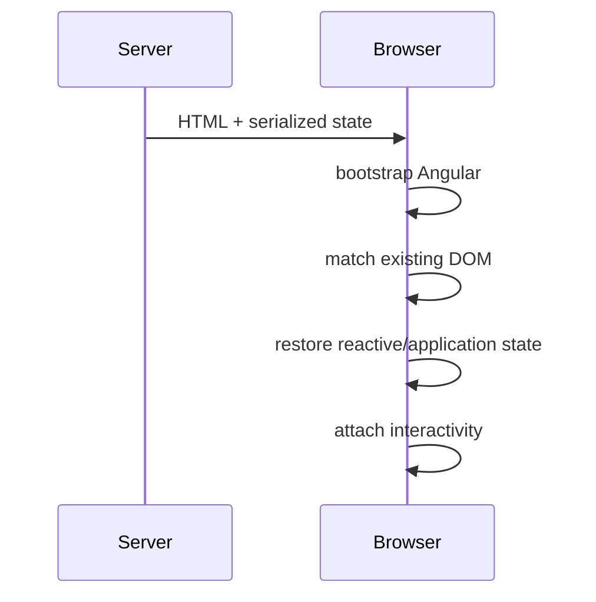

# 14 — SSR, Hydration, Runtime Configuration and Angular Testing: Deep Dive

## Wall Note / A4

- Browser code and server code execute in different environments.
- SSR is per-request; never leak user-specific mutable state across requests.
- Hydration reuses server-rendered DOM; deterministic server/client output matters.
- Incremental hydration can defer interactivity for selected regions.
- Frontend config delivered to the browser is public.
- Angular component tests should include template + class behavior where that integration is the risk.
- Avoid forcing change detection in tests in ways production would never schedule.

## Detailed Notes

### 1. Render modes

Modern Angular applications can combine:
- client-side rendering;
- prerender/static generation;
- server-side rendering.

Choose by route/content needs.

**CSR**
- highly interactive authenticated areas;
- no SEO/static requirement;
- simpler server operation.

**Prerender**
- content known at build time;
- docs/marketing/static catalog pages.

**SSR**
- request-dependent content;
- initial HTML needed per request;
- discoverability/perceived startup requirements.

Do not SSR every route automatically.

### 2. Per-request state

Danger:

```ts
@Injectable({ providedIn: 'root' })
export class CurrentUserCache {
  user?: User;
}
```

In server execution, careless global/singleton state can risk cross-request leakage depending on how the application/server environment is constructed.

Design request-sensitive state with explicit request ownership and verify the framework/runtime lifecycle you are using.

### 3. Browser-only APIs

Unsafe on server:

```ts
const theme = localStorage.getItem('theme');
```

Better:
- isolate browser storage behind an adapter;
- gate access by platform/environment;
- provide server-safe implementation.

Do not scatter `typeof window !== 'undefined'` everywhere; centralize platform boundaries.

### 4. Hydration mental model



Hydration avoids throwing away server HTML and rebuilding the DOM from scratch.

### 5. Hydration mismatch causes

Common causes:
- `Math.random()`;
- `Date.now()`;
- locale/time-zone differences;
- server/browser conditional structure;
- DOM mutation by third-party scripts before hydration;
- user-specific data not transferred consistently;
- invalid HTML structure corrected differently by browser parser.

Make initial render deterministic.

### 6. Transfer of fetched data

If data is fetched during SSR and immediately fetched again on the client, you get:
- duplicate latency/load;
- potential visual differences;
- hydration instability.

Use Angular-supported transfer/cache mechanisms for eligible data, with strict caution around user-specific/private information and shared caches.

### 7. Incremental hydration

Incremental hydration can keep parts of a server-rendered page non-interactive until a trigger requires hydration.

This can reduce initial JS/interactivity work for heavy regions.

Trade-offs:
- interaction triggers become architecture;
- event replay/user-experience behavior matters;
- debugging gets more complex;
- above-the-fold content needs careful prioritization.

### 8. Runtime configuration

Three categories:

**Build-time**
- compile flags;
- constants baked into bundle;
- optimization choices.

**Deployment/runtime public config**
- API base URL;
- public feature rollout configuration;
- observability endpoint/public IDs.

**Secrets**
- private API keys;
- DB credentials;
- signing secrets.

Secrets cannot live safely in shipped frontend JavaScript. If the browser can use a value, assume users can inspect it.

### 9. Angular component testing

A component is class + template + DI + DOM behavior.

Test the class alone when:
- pure transformation/state transition is the risk.

Use Angular component/TestBed integration when:
- binding;
- input/output behavior;
- DI/provider integration;
- DOM accessibility;
- routing;
- view lifecycle
are part of the risk.

### 10. Test scheduling and change detection

Modern Angular testing increasingly favors behavior that lets Angular schedule synchronization normally.

Overusing `fixture.detectChanges()` after every line can:
- hide missing reactive notifications;
- make tests pass even when production would not update correctly;
- couple tests to mechanics rather than behavior.

Prefer interacting through public inputs/events/signals and waiting for stable observable UI when appropriate.

### 11. Router tests

Router tests should verify:
- route activation;
- redirects;
- params/query params;
- feature provider lifetime where relevant;
- navigation-driven UI.

Avoid mocking the Router so deeply that no actual route configuration is exercised when configuration is the risk.

### 12. HTTP tests

Use Angular's HTTP testing infrastructure when testing:
- request URL/method/body;
- interceptor behavior;
- error mapping;
- cancellation/sequence;
- adapter logic.

Do not use it to duplicate backend business behavior.

### 13. Accessibility tests

Automate what is stable:
- role/name presence;
- label association;
- keyboard interaction;
- focus movement;
- dialog behavior;
- obvious rule-based accessibility violations.

Still perform manual assistive-technology review for critical flows; automation cannot prove usability.

## Practical Example — browser abstraction

```ts
export const BROWSER_STORAGE =
  new InjectionToken<StorageLike>('BROWSER_STORAGE');

export const browserStorageProvider = {
  provide: BROWSER_STORAGE,
  useFactory: (): StorageLike => {
    const platformId = inject(PLATFORM_ID);

    return isPlatformBrowser(platformId)
      ? window.localStorage
      : new MemoryStorage();
  }
};
```

Consumers no longer care whether they run in browser or server environment.

## Practical Example — component behavior test

```ts
it('submits the accessible form and shows success', async () => {
  const fixture = TestBed.createComponent(ProfileFormComponent);
  const native = fixture.nativeElement as HTMLElement;

  // Interact through the rendered UI rather than private fields.
  const email = native.querySelector<HTMLInputElement>('[name="email"]')!;
  email.value = 'ada@example.com';
  email.dispatchEvent(new Event('input'));

  native.querySelector<HTMLButtonElement>('button[type="submit"]')!.click();

  await fixture.whenStable();

  expect(native.querySelector('[role="status"]')?.textContent)
    .toContain('Saved');
});
```

The specific helper library can differ. The principle is behavior through the rendered contract.

## Failure Modes

- Reading `window` during SSR.
- Non-deterministic server/client first render.
- Re-fetching all SSR data after hydration.
- Caching user-specific SSR payload in a shared public cache.
- Shipping "secret" environment values in the frontend bundle.
- Mocking Router/HttpClient so heavily that Angular integration is never tested.
- Calling `detectChanges()` everywhere and masking missing update notifications.
- Treating automated accessibility scan as complete accessibility proof.

## Exercises / Senior Questions

1. Choose CSR/prerender/SSR for eight different routes.
2. Diagnose a hydration mismatch caused by locale/time.
3. Design safe public runtime configuration loaded at application start.
4. Explain why a frontend API key cannot be secret.
5. Test route-scoped state destruction when navigating away.
6. Write an Angular HTTP test for auth interceptor behavior.
7. Design accessibility tests for a modal dialog.
8. Explain how incremental hydration changes interaction/testing concerns.

## Related / Prerequisite Links

- [Testing/SSR/config/debug core](09-testing-ssr-config-debug.md)
- [Rendering/performance deep dive](13-rendering-zoneless-performance-deep-dive.md)
- [Testing engineering](https://github.com/YosrBennagra/testing-engineering)
- [Application security](https://github.com/YosrBennagra/application-security)
- [DevOps/platform engineering](https://github.com/YosrBennagra/devops-platform-engineering)
