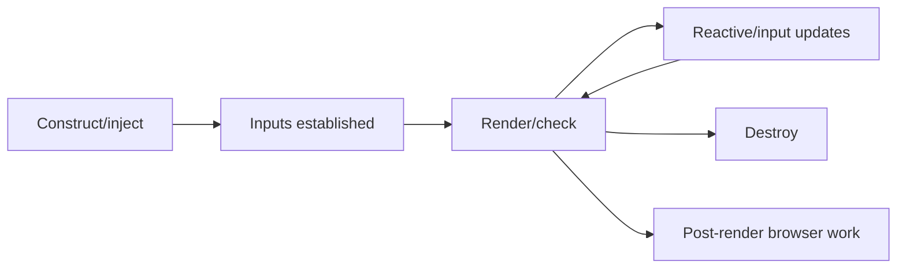

# 15 — Component Lifecycle, Queries and Composition: Deep Dive

## Wall Note / A4

- Creation, input updates, rendering and destruction are separate lifecycle concerns.
- Prefer declarative signal state over lifecycle-hook choreography.
- `DestroyRef` keeps setup and cleanup ownership explicit.
- `takeUntilDestroyed` ties RxJS subscriptions to Angular lifetime.
- View queries inspect a component's own view; content queries inspect projected content.
- Modern query functions return signals.
- Projected content remains owned by the parent that declared it.
- Use `afterNextRender` / render callbacks for browser DOM work that truly requires rendered DOM.
- Direct DOM manipulation is an escape hatch, not a default component architecture.

## Detailed Notes

### 1. Lifecycle mental model



Do not memorize hooks without understanding which phase owns the work.

### 2. Initialization

Constructor/injection time is appropriate for:
- dependency acquisition;
- defining signals/computed state;
- registering lifetime-bound infrastructure that does not require initialized inputs.

Input-dependent initialization belongs after input values exist or, better, in reactive derivations.

Avoid copying an input into local state once and then forgetting subsequent input changes.

### 3. Input signals

Modern Angular inputs can be signal-based:

```ts
readonly customer = input.required<Customer>();
readonly displayName = computed(() => this.customer().name.trim());
```

This is usually clearer than using `ngOnChanges` merely to recompute derived state.

Use `ngOnChanges` when you genuinely need the transition information, such as previous vs current input value.

### 4. Outputs and models

Use `output()` for events that communicate user intent or meaningful component events.

Use `model()` when the component's primary purpose is to edit a value and two-way binding is a natural contract.

Do not turn every input into a model; that weakens one-way ownership.

```ts
export class QuantityPicker {
  readonly quantity = model(1);
  readonly removed = output<void>();

  increment() {
    this.quantity.update(q => q + 1);
  }
}
```

### 5. Destruction and cleanup

Use `DestroyRef` when cleanup should live close to setup:

```ts
const destroyRef = inject(DestroyRef);

const observer = new ResizeObserver(entries => {
  // ...
});

observer.observe(element);

destroyRef.onDestroy(() => observer.disconnect());
```

For RxJS, `takeUntilDestroyed()` makes ownership explicit:

```ts
this.router.events
  .pipe(takeUntilDestroyed())
  .subscribe(event => this.track(event));
```

Do not manually create a `destroy$ = new Subject<void>()` in every component unless compatibility or architecture requires it.

### 6. Lifecycle hooks that deserve special caution

**ngDoCheck**
Runs frequently. Manual diffing here can be expensive and usually indicates that state changes are not modeled cleanly.

**ngAfterViewInit / ngAfterContentInit**
Useful when an imperative integration needs initialized child/content references, but signal queries often reduce the need to copy values during these hooks.

**ngAfterViewChecked / ngAfterContentChecked**
High-frequency hooks. Avoid heavy work and state writes that can create render loops.

### 7. Render callbacks

Use render callbacks such as `afterNextRender` for DOM work that must happen after Angular has rendered.

Examples:
- initialize a chart library requiring real element dimensions;
- measure layout after a write;
- integrate non-Angular widget.

Current Angular documentation exposes phased post-render work such as write/read phases to reduce layout thrashing.

These callbacks run in browser rendering contexts, not as a universal server lifecycle mechanism.

### 8. View queries

A view query finds children declared in **this component's template**.

```ts
readonly inputEl = viewChild.required<ElementRef<HTMLInputElement>>('search');

focusSearch() {
  this.inputEl().nativeElement.focus();
}
```

Modern query functions return signals that stay current as conditional content changes.

Do not query a child merely to mutate its internals. Prefer inputs/outputs when a declarative contract fits.

### 9. Content queries

A content query finds content projected **into** the component.

```ts
readonly actions = contentChildren(CardAction);
readonly actionCount = computed(() => this.actions().length);
```

Use this for compound-component APIs where the container and projected child directives/components deliberately collaborate.

### 10. Projection ownership

```html
<app-card>
  <app-card-title>Orders</app-card-title>
  <button appCardAction>Refresh</button>
</app-card>
```

The projected nodes render inside `app-card`, but they are declared/owned by the parent template.

That affects:
- dependency context;
- change ownership;
- queries;
- styling assumptions.

Do not assume projection transfers semantic ownership to the container.

### 11. ng-content

`<ng-content>` is a compile-time projection placeholder.

Use multiple slots deliberately:

```html
<header>
  <ng-content select="app-card-title" />
</header>
<section>
  <ng-content />
</section>
<footer>
  <ng-content select="[appCardAction]" />
</footer>
```

Do not use conditional control flow around `ng-content` as if it were a dynamically created template outlet. When conditional/template-fragment behavior is required, use the appropriate template mechanism.

### 12. Programmatic rendering

Dynamic component creation is justified for:
- plugin/widget systems;
- overlay/dialog infrastructure;
- type-driven dynamic panels.

Prefer normal template control flow when the set of components is statically known. Dynamic creation adds injection/lifecycle/content-projection complexity.

### 13. DOM access

Prefer:
- bindings;
- directives;
- host bindings;
- renderer/framework APIs.

Use direct native DOM access only when integrating capabilities not expressible declaratively, and keep browser/SSR constraints explicit.

## Practical Example — compound component

```ts
@Component({
  selector: 'app-tabs',
  standalone: true,
  template: `
    <div role="tablist">
      @for (tab of tabs(); track tab.id()) {
        <button
          role="tab"
          [attr.aria-selected]="tab.id() === selected()"
          (click)="selected.set(tab.id())">
          {{ tab.label() }}
        </button>
      }
    </div>
    <ng-content />
  `
})
export class TabsComponent {
  readonly tabs = contentChildren(TabComponent);
  readonly selected = model.required<string>();
}
```

The content query is justified because `TabsComponent` and projected `TabComponent` children intentionally form one compound control.

## Practical Example — third-party DOM integration

```ts
readonly host = viewChild.required<ElementRef<HTMLElement>>('chart');

constructor() {
  const destroyRef = inject(DestroyRef);

  afterNextRender({
    write: () => {
      const chart = createChart(this.host().nativeElement);
      destroyRef.onDestroy(() => chart.destroy());
    }
  });
}
```

Setup, rendered-DOM requirement and cleanup are explicit.

## Failure Modes

- Copy input into local signal once and let it drift.
- Use `ngDoCheck` for ordinary state synchronization.
- Subscribe manually without lifetime ownership.
- Query child internals instead of designing inputs/outputs.
- Mutate projected child state unexpectedly from container.
- Perform layout reads/writes repeatedly during checked hooks.
- Access DOM in code that also runs on the server.
- Build dynamic-component infrastructure for a static UI.

## Exercises / Senior Questions

1. Replace an `ngOnChanges` derived-value implementation with `computed`.
2. Choose `output()` vs `model()` for five component APIs.
3. Refactor a manual `destroy$` subscription to lifecycle-aware teardown.
4. Design a menu using content queries without making child internals globally mutable.
5. Explain view vs content ownership to another senior engineer.
6. Decide whether a chart integration belongs in `afterNextRender`, a directive or ordinary binding.
7. Review a component using `ngAfterViewChecked` to recalculate layout on every pass.

## Related / Prerequisite Links

- [Components/templates core](01-bootstrap-components-templates.md)
- [Rendering/performance deep dive](13-rendering-zoneless-performance-deep-dive.md)
- [SSR/testing deep dive](14-ssr-hydration-testing-runtime-deep-dive.md)
- [Testing engineering](https://github.com/YosrBennagra/testing-engineering)
- [Angular lifecycle guide](https://angular.dev/guide/components/lifecycle)
- [Angular queries guide](https://angular.dev/guide/components/queries)
